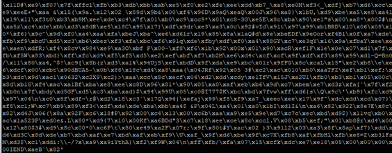
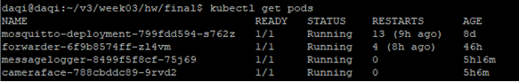
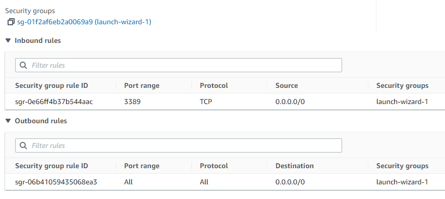
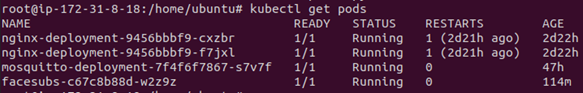

# JETSON: 

I use a ssh tunnel logged in Jetson and AWS instance for running everything from my local computer.

•	Login local Jetson: 10.0.0.106 \
•	Login AWS instance: 54.183.187.245

The Jetson is already set up from previous homeworks. The way to connect all files and systems is via GitHub and ssh tunneling. I built three docker images: 

•	The camera ( face detector, ubuntu) \
•	MQTT Broker ( MQTT client, Mosquitto) \
•	Forwarder ( MQTT Message forwarder, Alpine) \ 
•	MessageLogger 
 
### Camera (Facedetector) 

The docker files, deployment and cameraface.py that were used for the face detector container can be found in ./camera folder.Sample face images that were capture by the camera with Jetson nano, cut from the frame, sent over the pipeline and saved in the bucket can be found in my s3fs.  

Docker build -t cameraface:v1 . \
Kubectl apply -f camera-deployment.yaml 

### Broker: 

The docker files, deployment and service file used for the local broker container can be found in broker/mosquitto.  

Docker build -t mosquitto:v1 . \
Kubectl apply -f camera-deployment.yaml \
Kubectl apply -f camera-deployment.yaml 

### Forwarder

The docker file, forwarder.py and deployment file used for the forwarder container can be found in ./Forwarder folder.

Docker build -t forwarder:v1 . \
Kubectl apply -f  forwarder-deployment.yaml 

### Message Logger

The docker file, python and deployment file used for the message logger container can be found in ./messagelogger folder

Docker build -t messagelogger:v1 . \
Kubectl apply -f  messagelogger-deployment.yaml 

### A LIST OF THE JESTON PODS

# CLOUD INSTANCE: 

### Kubernetes instead of Docker has been used on the cloud side.

The inbound rule in network security has been modified to deploy kubenetes on cloud.

 

### CloudMQTTBroker: 
The docker files, deployment and service file used for the local broker container can be found in CloudMQTTBroker.  

Docker build -t mosquitto:v1 . \
Kubectl apply -f mosquitto.yaml \
Kubectl apply -f mosquittoService.yaml

### IMAGEPROCESSOR

The docker files, facesubs.py and deployment files used for image processor container can be found in ./ImageProcessor.

Docker build -t facesubs:v1 . \
Kubectl apply -f facesubs-deployment.yaml

### FILE UPLOADING

In this work, I use 2 methods to upload the image file to s3fs, please refer the code in facesubs.py:

(1) use boto3 to transfer the image file to s3fs. \
function to transfer to s3fs: \
s3 = boto3.client("s3", aws_access_key_id='xxxxxxxxxxx', aws_secret_access_key='xxxxxxxxxxxxxxx')

(2) mount my s3fs folder as a local shared folder, namely /mys3bucket, and save the image file into the shared folder /mys3bucket dicrectly. The path to my local shared folder mounted to s3fs: \
save_path = '/mys3bucket/' 

### My FACE ON CLOUD: 

The link:
https://drenhw3.s3.us-west-1.amazonaws.com/face90.jpg

