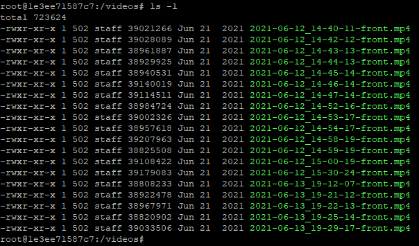
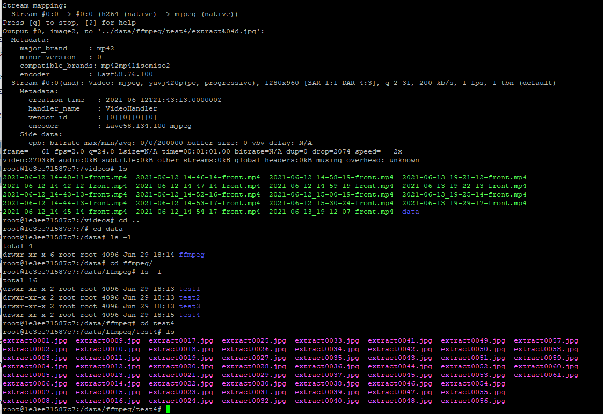
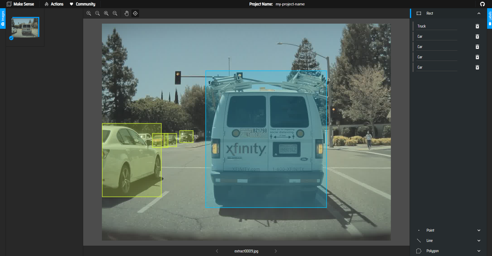
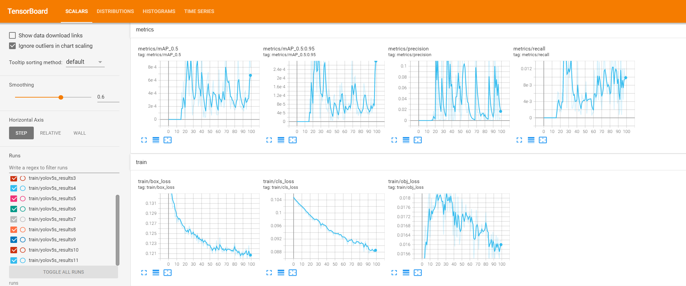

# HW08 

#### This homework is to create a small domain - specific dataset and use publicly available assets to create a custom models.

#### 1: Annotate some data from the Tesla cam:
I convert the video into images to use the images for annotation

I use the EfficientDet detector to annotate about images,owever I couldn't have done 300 images due to my time limitation. i attach one sample that I have created with two classes. Recommended: 'Car' and 'Truck'

I used MakeSense AI to annotate the image. The annotations are the coco format.

#### I used Active Learning in training

- I have trained for as many epochs as needed to cross the 0.25 mAP@.5. 

- Because I couldn't have 300 Tesla Cam labeled images, I used coco128 images instead. I hope this can get me some cridits. 

#### please find my code in [HW08.ipynb](HW08.ipynb)

Thank you very much. 
