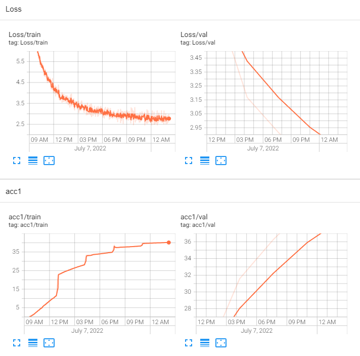

# HW09

###  1. Using 1 node 

Baseline performance is 15 hours for 5 epochs

 

### 2. Using 2 nodes parallel and distributed pytorch computing
The performance of 2 nodes in parallel is 7.5 hours for 5 epochs, that was exactely 1/2 of the baseline performance of 1 node.

3. Using 3 nodes parallel and distributed pytorch computing
The performance of 3 nodes in parallel is 5 hours for 5 epochs, that was exactely 1/3 of the baseline performance of 1 node.

 
