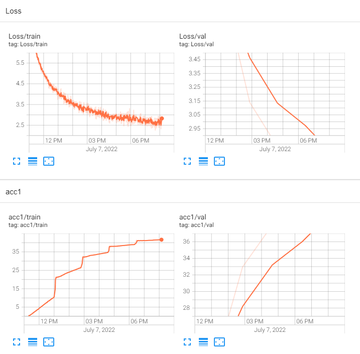
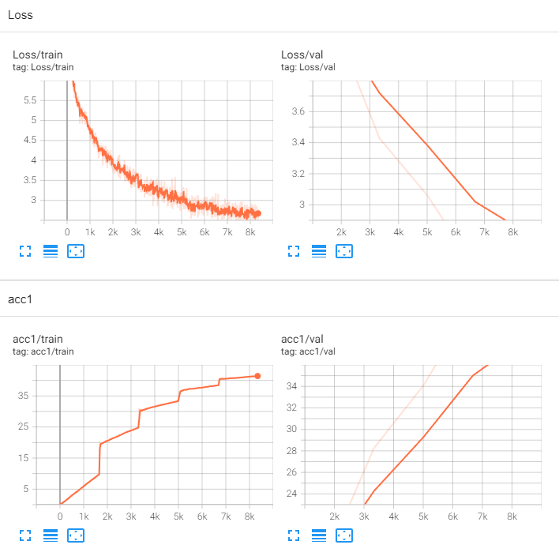
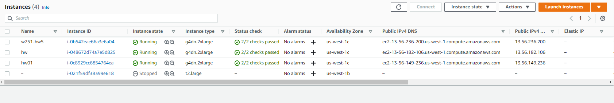
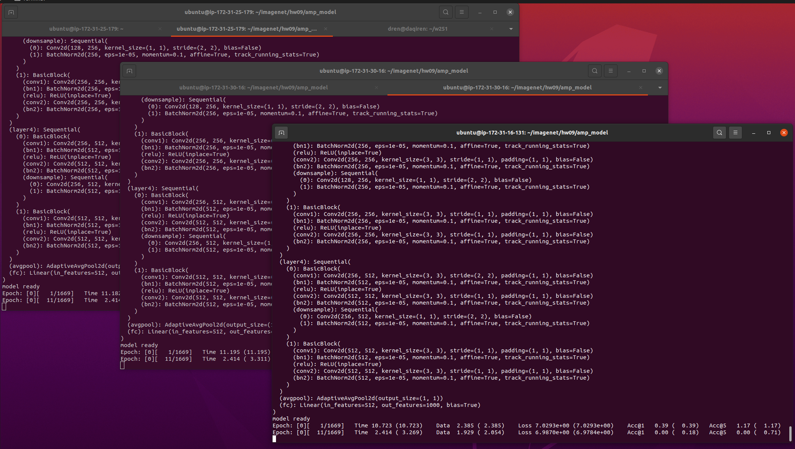
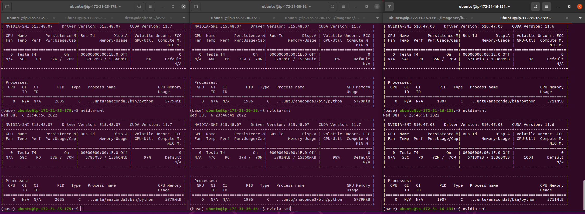
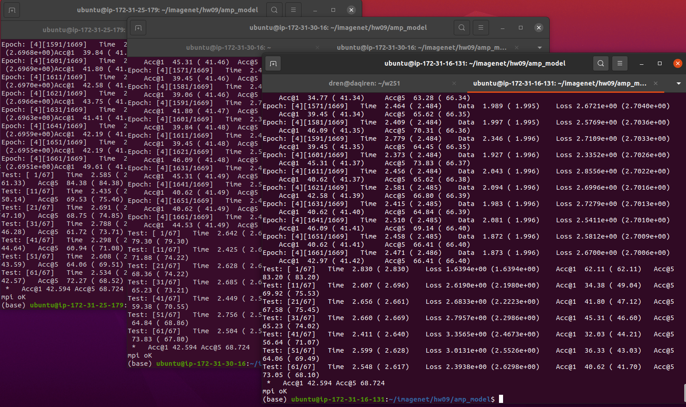

# HW09

##  1. Using 1 node 

#### Baseline performance is 15 hours for 5 epochs

## 2. Using 2 nodes parallel distributed pytorch computing
#### The performance of 2 nodes in parallel is 7.5 hours for 5 epochs, that was exactely 1/2 of the baseline performance of 1 node.

## 3. Using 3 nodes parallel distributed pytorch computing
#### The performance of 3 nodes in parallel is 5 hours for 5 epochs, that was exactely 1/3 of the baseline performance of 1 node.

## 4. Screenshots in 3 nodes parallel distributed pytorch computing
#### AWS node configuration and screenshot of parallel execution. 

#### The GPU usage on each node, they reached >95% usages.

#### The result of each node after 3 nodes 5 epochs run.  

